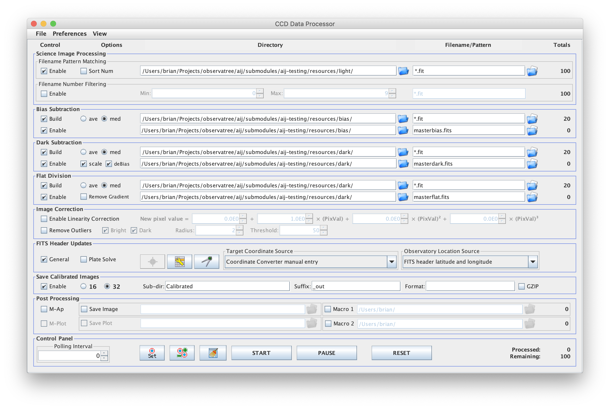

Test Plan
=========

This is a test plan for a basic system test or "smoke test"
of an AstroImageJ release candidate.

Preliminaries and Prerequisites
-------------------------------

For this test plan to be more than a recipe to be followed,
the tester should be at least somewhat familiar with the theory and
practice of exoplanet transit observation such as is thoroughly discussed
in Bruce Gary's book, "Exoplanet Observing for Amateurs." The "Third
Edition" aka "Second Edition (plus)" of the book is available as a
[zipped pdf](http://brucegary.net/book_EOA/ExoplanetObservingAmateurs2ndEdition.zip)
directly from the author. Alternatively, Dennis Conti's AAVSO
CHOICE course is an efficient way to become familiar with the
practice of differential photometry (see
[acknowledgements in README.md](./README.md#acknowledgements)).

The test plan assumes that you have bias, dark, flat and light images
already taken, such as the TrES-2 transit images in the resources
directory. The test plan also assumes you have followed the
AstroImageJ installation instructions, including the workaround for
clearing the quarantine bit as is required for proper ImageJ or 
AstroImageJ execution on macOS 10.12 and higher.

Part A - The Data Processor
---------------------------

Use the Data Processor (DP) window to make the masterbias.fits,
masterflat.fits, masterdark.fits and calibrated lights files.
Compare each of the settings so that the DP window looks like
this: 

During thie data processing step you can also tell AIJ
exactly what part of the sky is being looking at. With an account at a
web-based plate solver, AIJ will do this automatically. Typically
it is only done on the first image in a sequence. There is also a
place to input the exact time of the pictures and location of the
observatory (lat/long).

Part B - Aperture Selection and Alignment (aka Registration)
------------------------------------------------------------

Open the calibrated lights as a virtual stack ALWAYS (a "virtual"
stack is a list of images that AIJ does not attempt to keep
simultaneously in memory). Align the images by choosing the inner and
outer radii of the apertures and selecting the target as well as
several reference stars. The best reference stars are fairly close to
the target star, but isolated so other stars are not caught in the
"background" of the star aperture. They should also be towards the
middle of the picture, to ensure that the star did not move out of
frame during the observing session. NB: If for some reason during the
observing session (such as buffeting by wind) the telesope moved so
that the stars jump significantly across the image, set the aperture
radii to a high or highest setting. This will allow AIJ will to find
the stars. Is it sometimes necessary to run multiple alignment
procedues, decreasing the radii each time.

Part C - Aperture Photometry
----------------------------

Open the final set of now aligned and calibrated lights (as a
virtual stack!). Select "multiple aperture photomety" and set the
radii to the lowest possbile setting. Select the Target star and the
3-4 comparison stars used in the alignment (not necessary, but the
photos were already aligned for these stars and these stars should be
relatively bright, clear, and isolated). Hit enter. Always save the
table of measurements once it pops up.

Part D - Analysis and Plotting
------------------------------

Suggested by Dennis: make a copy of the target star's flux (I'm not
sure why this is part of the workflow, but see where it is used in
Part E below.) Graph the fluxes of the target and reference
stars. Ideally each reference star would be close to a straight line
relative to the mean of the reference stars. If there is one
significant outlier, consider removing that one from the calculations,
or re-do the whole process with different comparison stars.

Part E - Fitting
----------------

For the copy of the target star flux, choose the "Norm/Mag Ref" to
be green_white_green. This will use the data from before and after the
transit to calculate the norm of the target star flux. Leave it as all
green for the others. NB: How AIJ is computing a
signal-to-noise-weighted mean of the reference stars is important to
reproduce.

For the copy of the target star flux, select the "fit mode" to be
that of an exoplanet. Leave the original target star data. Select a
straight line for the comparison stars. In the "Multi-plot Main"
window, it is possible to input V Marker 1 and V Marker 2, for known
points of ingress and egress although this of course presumes part of
what an unconstrained fit will find. NB: How AIJ does its best fit
(ingress times, egress times, transit depth) is critical to reproduce
exactly for believability/comparability with most members of the
amateur exoplanet community, who typically are using AIJ on Windows.

Execute the fit. A window will pop up asking how the fit should be
created. It will also provide values for the ratio of planet to host
star size and its orbit around the star, and can additionally provide
absolute values for the properties of the planet if the properties of
the host star are known.
